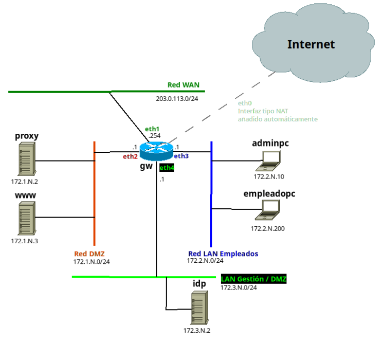

# Proyecto SAD
Nuestro proyecto de prueba para el módulo de Seguridad y Alta Disponibilidad de 2° de ASIR para simular la infraestructura y
seguridad de una PYME.

## 1. Estructura



### 1. Gateway y Enrutador (gw)

Actúa como router central, cortafuegos (iptables/nftables) y nodo VPN. Separa fisicamente (mediante redes internas
de VirtualBox) todas las subredes.

* SO: Ubuntu 24.04
* Hostname: `gw-aut`
* Interfaces de red:
    * `eth0` (NAT): Salida a Internet básica (Vagrant por defecto).

     * `eth1` (Bridge): Conexión puente a la red física del aula (para Site-to-Site VPN). IP asignada por el instituto.
     * `eth2` (DMZ): `172.1.9.1`
    * `eth3` (Empleados): `172.2.9.1`
    * `eth4` (Gestión): `172.3.9.1`

### 2. LAN de Gestión/Intranet (172.3.9.0/24)

Red para los servidores críticos internos y la administración. No tiene acceso directo desde Internet. Salida a Internet enrutada por el `gw`.

* Proveedor de Identidades (`idp`)
    * SO: Ubuntu 24.04
    * Hostname: `idp-aut`
    * IP: `172.3.9.2`
    * Rol: Servidor OpenLDAP

* Servidor de Backups (`backup-srv`)
    * SO: Alpine Linux
    * Hostname: `backup-srv-aut`
    * IP: `172.3.9.20`
    * Rol: Tira de `pull` de los datos (mediante `rsync` y `cron`) de los demás servidores hacia su almacenamiento local de forma segura.

### 3. LAN de Empleados (172.2.9.0/24)

Red de usuarios estándar. Navegación restringida a través del proxy.

* Equipo de Administración (`adminpc`)
    * SO: Alpine Linux
    * Hostname: `adminpc-aut`
    * IP: `172.2.9.10`
    * Rol: Máquina de salto y gestión. Desde aquí el administrador despliega scripts, se conecta por SSH a los demás equipos usando claves, etc.

* Equipo Empleado (`empleado`)
    * SO: Alpine Linux
    * Hostname: `empleadopc-aut`
    * IP: `172.2.9.100`
    * Rol: Simula a un empleado de la PYME.

### 4. DMZ - Zona Desmilitarizada (172.1.9.0/24)

Servicios expuestos o que intermedian con el exterior.

* Servidor Proxy (`proxy`)
    * SO: Ubuntu 24.04
    * Hostname: `proxy-aut`
    * IP: `172.1.9.2`
    * Rol: Proxy web (Squid) para filtrar tráfico de los empleados.

* Servidor Web (`www`)
    * SO: Alpine Linux
    * Hostname: `www-aut`
    * IP: `172.1.9.3`
    * Rol: Aloja los servicios web expuestos de la PYME y DVWA para las prácticas de Pentesting (Red Team).

## 2. Instrucciones para el despliegue

### 2.1. Requisitos previos

Tener instalado lo siguiente:

* Git
* VirtualBox
* Vagrant

### 2.2. Despliegue

1. Clonar este repositorio

```bash
$ git clone https://github.com/AUTRTOR/sad-proyecto-AUT-2026.git
```

2. Levantar con vagrant
```bash
$ cd SAD-PROYECTO-2026-26-solucion
$ vagrant up
```
3. Una vez levantado comprobamos el estado de las máquinas con
```bash
$ vagrant status
```
4. Y accedemos a las máquinas con `vagrant ssh maquina`. Ej. para acceder a www:
```bash
$ vagrant ssh www
```
